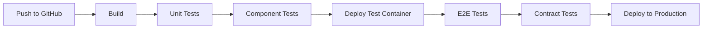

# Todo Frontend Application

> A modern, fully-tested Todo application built with **Next.js 14**, following **Test-Driven Development (TDD)** principles and deployed with **CI/CD automation**.

[](https://github.com/deha388/todo-frontend-playwright/actions)
[]()
[]()
[]()
[]()

## 🎯 Project Overview

This project demonstrates enterprise-level frontend development practices including:

- ✅ **Test-Driven Development (TDD)** - Every feature starts with failing tests
- ✅ **Multiple Test Types** - Unit, Component, Integration, Contract, and E2E tests
- ✅ **CI/CD Pipeline** - Automated build, test, and deployment
- ✅ **Containerization** - Docker for consistent environments
- ✅ **Kubernetes Deployment** - Production-ready orchestration
- ✅ **TypeScript** - Type safety throughout the application

## 🏗️ Architecture & Design Decisions

### Frontend Architecture
- **Framework**: Next.js 14 with App Router
- **Language**: TypeScript for type safety
- **State Management**: React Hooks (`useState`, `useEffect`)
- **Styling**: Inline styles (minimal, no over-engineering)
- **API Communication**: Next.js API Routes as server-side proxy

### Key Architectural Decisions

#### 1. **Server-Side Proxy Pattern**
**Problem**: Client-side JavaScript cannot access internal Kubernetes services directly.

**Solution**: Next.js API Routes (`/src/app/api/todos/route.ts`) act as a server-side proxy:
```
Browser → /api/todos → Next.js Server → Internal K8s Service (todo-backend-service:8083)
```

**Benefits**:
- Secure internal service communication
- Same-origin requests from browser
- Environment-specific backend URLs

#### 2. **Custom React Hook for Business Logic**
**Decision**: Encapsulate todo operations in `useTodos` hook.

**Benefits**:
- Separation of concerns (UI vs Business Logic)
- Reusable logic across components
- Easier testing of business logic

#### 3. **Multi-Stage Docker Build**
**Decision**: Separate dependencies and build stages for optimization.
```dockerfile
FROM node:18-alpine AS deps    # Production dependencies
FROM node:18-alpine AS builder # Build with all dependencies  
FROM node:18-alpine AS runner  # Minimal runtime image
```

#### 4. **Test Strategy**
- **Unit Tests**: Business logic in isolation
- **Component Tests**: UI rendering and interactions
- **Contract Tests**: API consumer expectations (Pact.js)
- **E2E Tests**: Full user workflows (Playwright)

## 🧪 Test-Driven Development (TDD) Process

This project strictly follows TDD methodology:

### TDD Cycle: Red → Green → Refactor

#### Phase 1: Acceptance Tests (Red)
```bash
# 1. Write failing E2E test
npm run test:e2e  # ❌ FAIL: Feature doesn't exist
```

#### Phase 2: Component Tests (Red → Green)
```bash
# 2. Write failing component tests
npm test tests/components  # ❌ FAIL: Component doesn't exist

# 3. Implement minimal UI to pass tests  
npm test tests/components  # ✅ PASS: Component renders
```

#### Phase 3: Unit Tests (Red → Green)
```bash
# 4. Write failing unit tests for business logic
npm test tests/unit  # ❌ FAIL: Hook doesn't exist

# 5. Implement business logic to pass tests
npm test tests/unit  # ✅ PASS: Logic works
```

#### Phase 4: Contract Tests (Red → Green)
```bash
# 6. Write API contract expectations
npm run test:contracts  # ❌ FAIL: API doesn't match contract

# 7. Implement API integration
npm run test:contracts  # ✅ PASS: API contract verified
```

#### Phase 5: Refactor & Integration
```bash
# 8. All tests should pass
npm test           # ✅ PASS: Unit + Component
npm run test:e2e   # ✅ PASS: E2E acceptance
npm run test:contracts  # ✅ PASS: API contracts
```

### TDD Benefits Achieved
- **Design First**: Tests drive the API design
- **Safety Net**: Refactoring with confidence
- **Documentation**: Tests serve as living documentation
- **Quality**: High test coverage and reliability

## 🚀 Quick Start

### Prerequisites
- Node.js 18+ 
- npm or yarn
- Docker (for containerization)
- Git

### Development Setup

```bash
# 1. Clone the repository
git clone https://github.com/deha388/todo-frontend-playwright.git
cd todo-frontend-playwright

# 2. Install dependencies
npm install

# 3. Start development server
npm run dev

# 4. Open in browser
open http://localhost:3000
```

### Running Tests

```bash
# Unit and Component tests
npm test tests/unit tests/components

# Contract tests (requires Pact mock server)
npm run test:contracts

# E2E tests (requires running application)
npm run test:e2e

# All tests
npm test
```

## 🛠️ Build & Deploy

### Local Build
```bash
# Build for production
npm run build

# Start production server
npm start
```

### Docker Build
```bash
# Build Docker image
docker build -t todo-frontend:latest .

# Run container
docker run -p 3000:3000 \
  -e BACKEND_URL=http://your-backend:8083 \
  todo-frontend:latest
```

### Kubernetes Deployment
```bash
# Apply Kubernetes manifests
kubectl apply -f k8s-simple.yaml

# Check deployment status
kubectl get pods,services

# Access application
kubectl port-forward service/todo-frontend-service 3000:80
```

## 🔄 CI/CD Pipeline

### Automated Pipeline Stages



### Pipeline Configuration
The pipeline is defined in `.github/workflows/simple-deploy.yml`:

1. **Build Stage**: Next.js build and artifact upload
2. **Test Stage**: Unit and component tests
3. **Deploy Test**: Build and deploy test container on VPS
4. **E2E Tests**: Playwright tests against test container
5. **Contract Tests**: Pact.js API contract verification
6. **Deploy Production**: Deploy to Kubernetes cluster

### Environment Variables (GitHub Secrets)
- `DO_HOST`: Production server IP address
- `DO_USERNAME`: SSH username for deployment
- `DO_PASSWORD`: SSH password for deployment

## 📁 Project Structure

```
todo-frontend-playwright/
├── src/
│   ├── app/
│   │   ├── api/todos/          # Next.js API routes (server-side proxy)
│   │   ├── page.tsx            # Root page component
│   │   └── layout.tsx          # App layout
│   ├── components/
│   │   ├── TodoApp.tsx         # Main application component
│   │   └── TodoList.tsx        # Todo list display component
│   ├── hooks/
│   │   └── useTodos.ts         # Custom hook for todo business logic
│   └── types/
│       └── todo.ts             # TypeScript type definitions
├── tests/
│   ├── acceptance/             # E2E tests (Playwright)
│   ├── components/             # Component tests (Jest + RTL)
│   ├── contracts/              # API contract tests (Pact.js)
│   └── unit/                   # Unit tests (Jest)
├── .github/workflows/
│   └── simple-deploy.yml       # CI/CD pipeline configuration
├── k8s-simple.yaml             # Kubernetes deployment manifest
├── Dockerfile                  # Multi-stage Docker build
├── playwright.config.ts        # Playwright configuration
├── jest.config.js              # Jest configuration
└── package.json                # Dependencies and scripts
```

## 🔌 API Integration

### Backend Communication
Frontend communicates with backend through Next.js API routes acting as a proxy:

```typescript
// Client-side request
fetch('/api/todos')  // Same-origin request

// Server-side proxy (src/app/api/todos/route.ts)
fetch(`${BACKEND_URL}/api/todos`)  // Internal service call
```

### Environment Configuration
- **Development**: `BACKEND_URL=http://localhost:8083`
- **Production**: `BACKEND_URL=http://todo-backend-service:8083` (K8s internal service)

### API Endpoints
- `GET /api/todos` - Retrieve all todos
- `POST /api/todos` - Create new todo

## 🐳 Containerization

### Multi-Stage Docker Build
- **deps**: Install production dependencies
- **builder**: Install all dependencies and build application
- **runner**: Minimal runtime image with built application

### Optimization Features
- Node.js Alpine base image for smaller size
- Multi-stage build to exclude dev dependencies
- Non-root user for security
- Next.js standalone output for minimal runtime

## ☸️ Kubernetes Deployment

### Components
- **Deployment**: Frontend application pods
- **Service**: Internal cluster service (ClusterIP)
- **Service**: External access (NodePort on port 30000)

### Configuration
- **Replicas**: 1 (optimized for single VPS)
- **Resources**: 128Mi RAM, 100m CPU requests
- **Image Pull Policy**: Never (uses locally built images)

## 🔍 Monitoring & Debugging

### Health Checks
The application includes built-in health monitoring:
- Docker container health checks
- Kubernetes readiness/liveness probes
- Pipeline health verification

### Debugging
```bash
# Check container logs
docker logs test-container

# Check Kubernetes pod logs  
kubectl logs -f deployment/todo-frontend

# Pipeline debugging
# Check GitHub Actions logs for detailed CI/CD information
```

## 🤝 Development Workflow

### Adding New Features
1. **Start with E2E test** (failing)
2. **Write component tests** (failing)
3. **Implement component** (tests pass)
4. **Write unit tests** for business logic (failing)
5. **Implement business logic** (tests pass)
6. **Add contract tests** if API changes needed
7. **Refactor** with confidence
8. **Commit and push** (triggers CI/CD)

### Code Quality Standards
- TypeScript strict mode enabled
- Comprehensive test coverage
- Consistent code formatting
- TDD methodology enforced

## 📚 Technologies Used

| Category | Technology | Purpose |
|----------|------------|---------|
| **Framework** | Next.js 14 | React-based full-stack framework |
| **Language** | TypeScript | Type-safe JavaScript |
| **Testing** | Jest | Unit and component testing |
| **Testing** | React Testing Library | Component testing utilities |
| **Testing** | Playwright | End-to-end testing |
| **Testing** | Pact.js | Consumer-driven contract testing |
| **Containerization** | Docker | Application packaging |
| **Orchestration** | Kubernetes | Container orchestration |
| **CI/CD** | GitHub Actions | Automated pipeline |
| **State Management** | React Hooks | Built-in state management |

## 🚀 Production Deployment

The application is automatically deployed to a DigitalOcean VPS running Kubernetes (K3s) upon successful CI/CD pipeline completion.

### Production Architecture
```
Internet → VPS (DigitalOcean) → K3s Cluster → Frontend Pod → Backend Service
```

### Access
- **Application**: `http://[VPS-IP]:30000`
- **Deployment**: Automatic via GitHub Actions
- **Monitoring**: CI/CD pipeline status and logs

## 📈 Performance Considerations

- **Next.js Optimizations**: Automatic code splitting, image optimization
- **Docker Multi-stage**: Reduced image size
- **Kubernetes Resources**: Optimized for VPS constraints
- **Build Optimization**: Production-ready builds with minification

## 🔐 Security

- **Non-root Docker user**: Enhanced container security
- **Internal service communication**: Secure K8s networking
- **Environment variable management**: Secrets via GitHub Actions
- **Input validation**: TypeScript type checking

## 📄 License

This project is open source and available under the [MIT License](LICENSE).

## 🤝 Contributing

1. Fork the repository
2. Create a feature branch (`git checkout -b feature/amazing-feature`)
3. Follow TDD principles - write tests first!
4. Commit your changes (`git commit -m 'Add amazing feature'`)
5. Push to the branch (`git push origin feature/amazing-feature`)
6. Open a Pull Request

---

**Built with ❤️ using Test-Driven Development** 